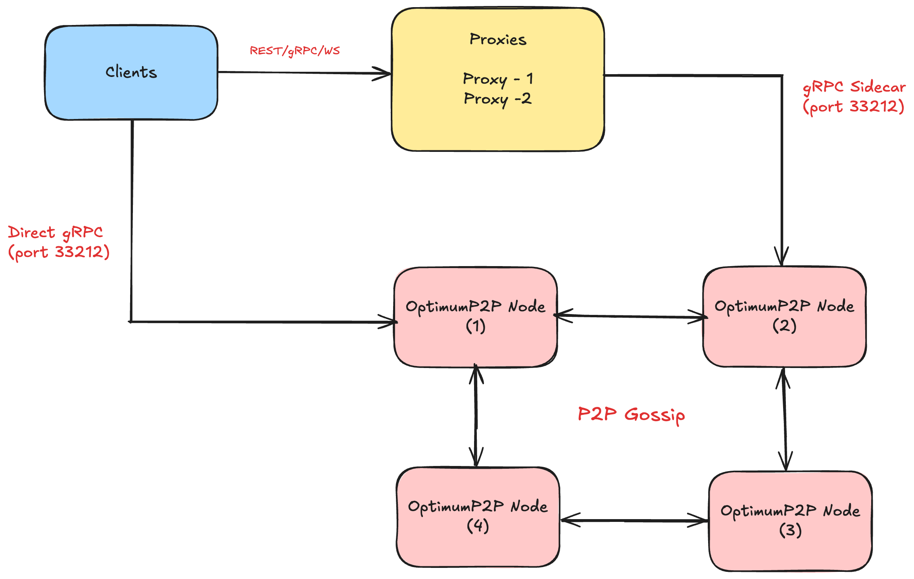

# OptimumP2P – Local Development Setup

## **IMPORTANT: Remote P2P Nodes for Distributed Testing**

> **🚨 CRITICAL FOR PARTICIPANTS**: Use these remote nodes for distributed testing and hackathon projects!

### **External/Remote P2P Nodes**

For connecting to external P2P nodes or remote clusters, use the standard sidecar port `33212`:

```bash
# Connect to external P2P nodes
./grpc_p2p_client/p2p-client -mode=subscribe -topic=mytopic --addr=node1.example.com:33212
./grpc_p2p_client/p2p-client -mode=publish -topic=mytopic -msg="Hello World" --addr=node2.example.com:33212
```

**Port Usage Summary:**

- **Local Docker**: Use `127.0.0.1:33221-33224` (Docker port forwarding)
- **External/Remote**: Use `node-ip:33212` (standard sidecar port)

---

This repository provides a full-stack setup for running OptimumP2P, a high-performance RLNC-enhanced pubsub protocol, along with multiple proxies for scalable message routing.
This repository provides a sample Docker Compose setup for deploying the OptimumP2P messaging infrastructure locally.
It demonstrates how partners can configure proxies and P2P nodes, and serves as a reference architecture for integration, testing, and scaling into production.

## Architecture



### How it works

- Clients (like CLI, dApps, or backend services) interact with Proxies using REST/WebSocket.
- Proxies handle user subscriptions, publish requests, and stream delivery.
- Proxies connect to multiple P2P nodes via gRPC sidecar connections.
- P2P nodes form an RLNC-enhanced mesh network, forwarding messages via coded shards.
- Messages propagate based on configurable thresholds and shard redundancy.

> **Note:** OptP2P refers to the main set of P2P nodes forming the core mesh network. The Proxy acts as a proxy, providing controlled and secure access to all P2P nodes for external clients and integrations (e.g., Matrix, collaboration tools, etc.). For native integrations or advanced use cases, you can interact directly with the P2P mesh, bypassing the Proxy for full flexibility and performance.

**Important:** Proxies are stateless and horizontally scalable. P2P nodes form a resilient gossip + RLNC mesh.

## Purpose

This setup is not production-ready but is designed to:

- Show how to run multiple P2P nodes and proxies
- Demonstrate typical configuration options
- Help partners bootstrap their own network using OptimumP2P

**You are expected to modify this template based on your environment, infrastructure, and security needs.**

## What It Includes

- 4 P2P Nodes running the OptimumP2P
- 2 Proxies for client-facing APIs (HTTP/WebSocket)
- Static IP overlay (optimum-network) for deterministic internal addressing
- .env-based dynamic peer identity setup
- Optional Auth0 support (disabled by default)

## Example: Basic Usage

### Quick Start with Makefile

```sh
# Show help and available commands
make help
make

# Build all client binaries
make build

# Generate P2P identity (if needed)
make generate-identity

# Subscribe to a topic
make subscribe 127.0.0.1:33221 testtopic

# Publish messages
make publish 127.0.0.1:33221 testtopic random
make publish 127.0.0.1:33221 testtopic random 10 1s
```

### Direct Binary Usage (Recommended)

```sh
# Subscribe to a topic (in one terminal)
./grpc_p2p_client/p2p-client -mode=subscribe -topic=testtopic --addr=127.0.0.1:33221

# Publish messages (in another terminal)
./grpc_p2p_client/p2p-client -mode=publish -topic=testtopic -msg=HelloWorld --addr=127.0.0.1:33222

# Publish multiple messages with delay
./grpc_p2p_client/p2p-client -mode=publish -topic=testtopic -msg="Random Message" --addr=127.0.0.1:33222 -count=5 -sleep=1s
```

**Example Output:**

```sh
# Subscribe output:
Connecting to node at: 127.0.0.1:33221…
Trying to subscribe to topic testtopic…
Subscribed to topic "testtopic", waiting for messages…
Recv message: [1] [1757588485854443000 75] [1757588485852133000 50] HelloWorld
Recv message: [2] [1757588486911800000 85] [1757588486909514000 60] P2P message 1 - 56a4322c

# Publish output:
Connecting to node at: 127.0.0.1:33222…
Published "[1757588485852133000 50] HelloWorld" to "testtopic" (took 840.875µs)
```

---

## Repository Structure

```sh
optimum-dev-setup-guide/
├── docs/                   # Documentation
│   ├── guide.md           # Complete setup guide
│   └── intro.png          # Architecture diagram
├── grpc_p2p_client/       # P2P client implementation
│   ├── grpc/              # Generated gRPC files
│   ├── proto/             # Protocol definitions
│   └── p2p_client.go      # Main P2P client
├── grpc_proxy_client/     # Proxy client implementation
│   ├── grpc/              # Generated gRPC files
│   ├── proto/             # Protocol definitions
│   └── proxy_client.go    # Main proxy client
├── keygen/                # Key generation utilities
│   └── generate_p2p_key.go
├── script/                # Utility scripts
│   ├── generate-identity.sh # Bootstrap identity generation
│   └── proxy_client.sh     # Proxy client wrapper
├── Makefile               # Build shortcuts and usage examples
├── docker-compose-optimum.yml   # OptimumP2P service orchestration
├── docker-compose-gossipsub.yml # GossipSub service orchestration
├── test_suite.sh          # API validation tests
└── README.md              # This file
```

---

## 📚 Complete Setup Guide

For detailed setup instructions, configuration options, API reference, and troubleshooting, see:

**[Complete Setup Guide](./docs/guide.md)** - Comprehensive documentation covering:

- Prerequisites and detailed setup
- Configuration options for proxies and P2P nodes
- API reference (REST, gRPC, WebSocket)
- Authentication and rate limiting
- Monitoring and telemetry
- Troubleshooting and performance optimization

---

## Quick Start

```sh
# 1. Generate bootstrap identity
./script/generate-identity.sh

# 2. Configure environment (create .env file)
# Create .env with your generated bootstrap peer ID and assigned cluster ID

# 3. Start all services (OptimumP2P)
docker-compose -f docker-compose-optimum.yml up --build -d

# 4. Test the setup
./test_suite.sh
```

### Environment Configuration

Create `.env` file with your assigned credentials:

```sh
BOOTSTRAP_PEER_ID=<your-generated-peer-id>
CLUSTER_ID=<your-assigned-cluster-id>
```

> **Note**: Each participant will generate their own unique bootstrap identity and receive their assigned cluster ID for their specific testing environment.

## Available Commands

### Makefile Commands

The Makefile provides convenient shortcuts for common development tasks:

```sh
# Show all available commands and usage examples
make help
```

**Output:**

```sh
build                          Build all client binaries
clean                          Clean build artifacts
generate-identity              Generate P2P identity (if missing)
help                           Show help
publish                        publish message to p2p topic: make publish <addr> <topic> <message|random> [count] [sleep]
subscribe                      subscribe to p2p topic: make subscribe <addr> <topic>

Direct binary usage (recommended):
  # Subscribe to a topic
  ./grpc_p2p_client/p2p-client -mode=subscribe -topic="testtopic" --addr="127.0.0.1:33221"

  # Publish messages
  ./grpc_p2p_client/p2p-client -mode=publish -topic="testtopic" -msg="Hello World" --addr="127.0.0.1:33221"
  ./grpc_p2p_client/p2p-client -mode=publish -topic="testtopic" -msg="Random Message" --addr="127.0.0.1:33221"

  # Publish multiple messages with options
  ./grpc_p2p_client/p2p-client -mode=publish -topic="testtopic" -msg="Random Message" --addr="127.0.0.1:33221" -count=10 -sleep=1s
```

### Working Makefile Commands

```sh
# Subscribe to a topic
make subscribe 127.0.0.1:33221 testtopic

# Publish random messages
make publish 127.0.0.1:33221 testtopic random

# Publish multiple random messages with delay
make publish 127.0.0.1:33221 testtopic random 10 1s
```

**Example Output:**

```sh
# Subscribe receives messages in real-time:
Connecting to node at: 127.0.0.1:33221…
Subscribed to topic "testtopic", waiting for messages…
Recv message: [1] [1757588485854443000 85] [1757588485852133000 60] P2P message 1 - 3cc8f3fb
Recv message: [2] [1757588486911800000 85] [1757588486909514000 60] P2P message 2 - b1d6de6c

# Publish sends messages:
Publishing random messages to topic=testtopic addr=127.0.0.1:33221 count=10 sleep=1s
Published "[1757588485852133000 60] P2P message 1 - 3cc8f3fb" to "testtopic" (took 72.042µs)
```

### Direct Binary Commands

#### P2P Client Commands

```sh
# Build the P2P client
make build

# Subscribe to a topic
./grpc_p2p_client/p2p-client -mode=subscribe -topic=testtopic --addr=127.0.0.1:33221

# Publish a single message
./grpc_p2p_client/p2p-client -mode=publish -topic=testtopic -msg=HelloWorld --addr=127.0.0.1:33222

# Publish multiple random messages with delay
./grpc_p2p_client/p2p-client -mode=publish -topic=testtopic -msg="Random Message" --addr=127.0.0.1:33222 -count=5 -sleep=1s
```

#### Command Options

The P2P client supports these flags:

- `-mode`: Operation mode (`subscribe` or `publish`)
- `-topic`: Topic name to subscribe/publish to
- `-addr`: P2P node gRPC address (default: `localhost:33212`)
- `-msg`: Message content (for publish mode)
- `-count`: Number of messages to publish (default: 1)
- `-sleep`: Delay between messages (e.g., `1s`, `500ms`)

#### Port Mapping

**Local Docker Development:**
The development setup exposes these P2P node ports:

- `127.0.0.1:33221` → p2pnode-1 (sidecar port 33212)
- `127.0.0.1:33222` → p2pnode-2 (sidecar port 33212)
- `127.0.0.1:33223` → p2pnode-3 (sidecar port 33212)
- `127.0.0.1:33224` → p2pnode-4 (sidecar port 33212)

## Developer Tools

You can use CLI for testing as well that connects to proxy

See CLI guide: [mump2p-cli](https://github.com/getoptimum/mump2p-cli)

## Testing

### Automated Test Suite

Run the comprehensive test suite to validate API endpoints and edge cases:

```sh
./test_suite.sh
```

**What it tests:**

- Proxy API endpoints (subscribe, publish, health, state, version)
- Input validation (empty fields, invalid JSON)
- Rapid request handling (5x publish test)
- WebSocket connection (if wscat is installed)
- Edge cases and error handling
